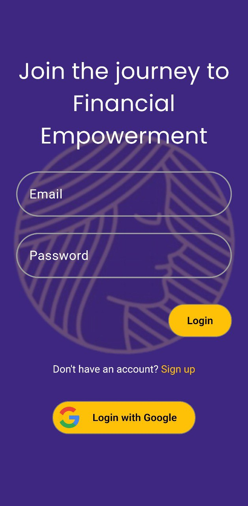
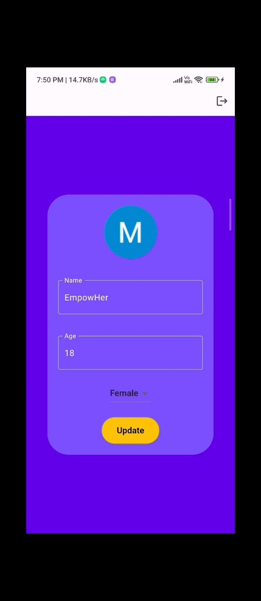
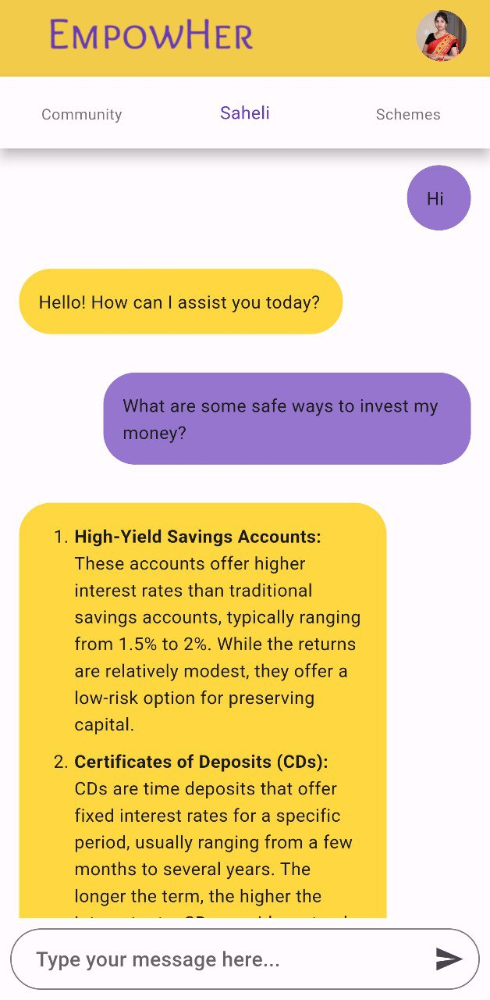
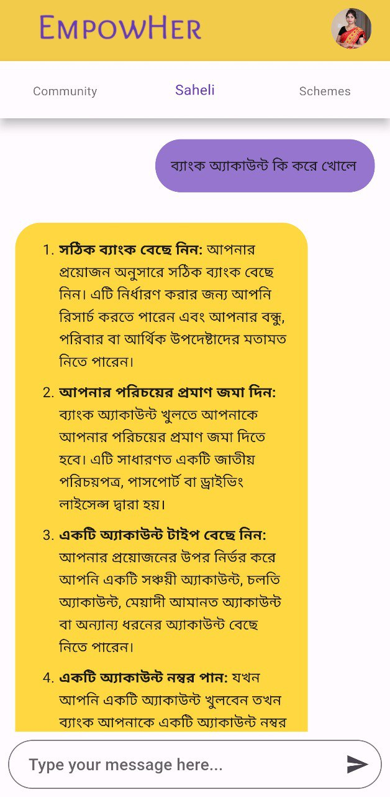
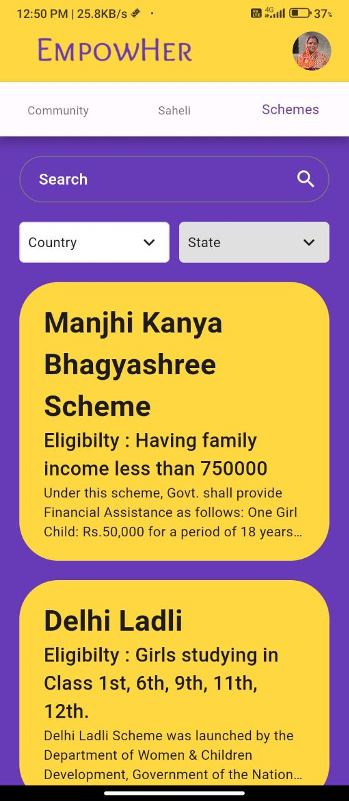

<a name="readme-top"></a>
<br />
<div align="center">
  <a href="https://github.com/mdanisulh/empowher">
    
  </a>

<a href="https://github.com/mdanisulh/empowher">
  <p align="center">
    
  </p>
  </a>
  <p align="center">
    An app to increase financial awareness among women
    <br />
    <a href="https://github.com/mdanisulh/empowher"><strong>Explore the docs »</strong></a>
    <br />
    <br />
    <a href="https://github.com/mdanisulh/empowher">View Demo</a>
    ·
    <a href="https://github.com/mdanisulh/empowher/issues">Report Bug</a>
    ·
    <a href="https://github.com/mdanisulh/empowher/issues">Request Feature</a>
  </p>
</div>

<!-- TABLE OF CONTENTS -->
<details>
  <summary>Table of Contents</summary>
  <ol>
    <li>
      <a href="#about-the-project">About The Project</a>
      <ul>
        <li><a href="#the-problem">The problem</a></li>
        <li><a href="#our-solution">Our solution</a></li>
        <li><a href="#built-with">Built With</a></li>
      </ul>
    </li>
    <li>
      <a href="#getting-started">Getting Started</a>
      <ul>
        <li><a href="#prerequisites">Prerequisites</a></li>
        <li><a href="#installation">Installation</a></li>
      </ul>
    </li>
    <li><a href="#roadmap">Roadmap</a></li>
    <li><a href="#license">License</a></li>
  </ol>
</details>

<!-- ABOUT THE PROJECT -->
## About The Project


### The problem:
* Financial planning and investment activities have long been considered the domain of men, with a majority of the women depending on either their parents or husbands to manage finances. This is despite the number of women who contribute to household finances having increased manifold in the last decade.
* India has been ranked 127 out of 146 countries in the latest Global Gender Gap report released by the World Economic Forum (WEF) for the year 2023.India's neighbours Pakistan ranked at 142, Bangladesh at 59, China at 107, Nepal at 116, Sri Lanka at 115 and Bhutan at 103.
* As per the Economic Survey 2021-22 tabled in Parliament, females are expected to live longer (70.7 years) than males (68.2 years). It implies that women need a bigger financial reservoir to ensure their financial security in their old age. Plus, they need to factor in additional healthcare expenses due to their longevity.

### Our solution
Welcome to EmpowHer! An app designed to foster financial awareness and empowerment among women and bridge the gap of gender inequality. 

<p float="center" align="center">
  
  
</p>

#### This comprehensive app has three main sections:
### 1. EmpowHer Community

Join a supportive community where women share financial achievements, seek advice, and learn from inspiring stories of women entrepreneurs

<div align="center"></div>

### 2. Saheli chatbot

Get answers to your financial questions in an easy-to-understand manner. Whether it's budgeting, saving, or investing, EmpowerHER Finance provides clear explanations to empower your financial decisions.

<div align="center"></div>

The bot supports over 40 languages. Users can chat with our bot in whichever language they are comfortable with.

<div align="center"></div>

### 3. Government Schemes and Policies

Explore a wealth of information on existing government schemes and policies tailored for women. Gain insights into available resources to support your financial well-being.

<div align="center"></div>

<!--[![Product Name Screen Shot][product-screenshot]](https://example.com) -->


### Built with

* Flutter
* Firebase

## Getting Started

### Prerequisites:

Before you can run a Flutter application, you need to ensure that your development environment is set up properly. Here are the prerequisites for running a Flutter application:

#### Flutter SDK:

Download and install the Flutter SDK from the official Flutter website: Flutter Install
Extract the downloaded ZIP file to a location on your machine.
Add the Flutter bin directory to your system's PATH variable.

#### Dart SDK:

Flutter relies on Dart programming language. It usually comes bundled with the Flutter SDK, but it's good to make sure that Dart is installed properly.
You can download Dart from the Dart SDK page: Dart SDK

#### Development Environment:

For developing Flutter applications, you can use a variety of IDEs (Integrated Development Environments) such as Visual Studio Code, Android Studio, or IntelliJ IDEA. Choose one that you are comfortable with.
Install the necessary plugins/extensions for Flutter and Dart support in your chosen IDE.

#### Device or Emulator:

You need a physical device or an emulator to run your Flutter app.
If you're using an emulator, make sure it's set up and running. You can use Android Emulator or iOS Simulator, depending on your target platform.

#### Git (Optional):

Some Flutter packages may require Git for version control. Install Git if you plan to work with such packages.
Download and install Git from the official Git website: Git

#### Enable Virtualization (for Android Emulator):

If you're using an Android emulator, ensure that virtualization is enabled on your machine. This is usually done through BIOS/UEFI settings.

#### Xcode (for macOS, for iOS development):

If you're developing for iOS on macOS, you'll need to have Xcode installed. You can download it from the Mac App Store.

#### Flutter Doctor:

Run flutter doctor in your terminal to check if there are any missing dependencies or issues that need to be addressed. It provides guidance on what needs to be installed or configured.
After setting up these prerequisites, you should be ready to create and run Flutter applications. Remember to check the official Flutter documentation for any updates or additional requirements specific to your development environment.

### Installation

To run a Flutter application, follow these general steps:

Navigate to Your Project Directory:

1. Open a terminal or command prompt.
  
* Change your working directory to the root directory of your Flutter project.

```bash
cd path/to/your/flutter/project 
```
2. Ensure Flutter Dependencies:

* Run the following command to check if there are any missing dependencies:
```bash
flutter doctor
```
* Address any issues reported by 'flutter doctor' before proceeding.
3. Connect a Device or Start an Emulator:

* Connect a physical device to your computer using a USB cable.
* Alternatively, start an emulator if you are developing for Android or iOS.
For Android:
```bash
flutter emulators
flutter emulators --launch <emulator_id>
```
For iOS:
```bash
open -a Simulator
```
4. Run the Application:

* Execute the following command to run your Flutter application:

```bash
flutter run
```
This command compiles the Flutter code and installs the app on the connected device or emulator.

If you have multiple devices or emulators, you may need to specify the target:

```bash
flutter run -d <device_id>
```
Replace <device_id> with the appropriate identifier for your target device.

You should see the app launching on the connected device or emulator. 

## Roadmap 
- [x] Identify key features and functionalities for each section.
- [x] Design the architecture.
- [X] Choose the appropriate technology stack for app development.
- [ ] Multi-language Support
- [X] Perform usability testing with a diverse group of potential users to identify and resolve any bugs or issues.
- [ ] Implement AI algorithms to manage EmpowHer community and make it more engaging and personalized. 
- [ ] Integrate advanced machine learning models to provide systematic investment plans to our users based on their budget.
- [ ] Collaborate with financial institutions to provide organised financial courses for free and partnerships with women-focused organizations.
- [ ] Expand the app's database to include schemes from different countries across the world, to address the issues on a global level.
- [ ] Release the app to the public, making it accessible to users.
- [ ] Continuously seek user feedback and iterate on the app to meet evolving user needs.

## License
Distributed under the MIT License. See `LICENSE.txt` for more information.


<!--
This project is a starting point for a Flutter application.

A few resources to get you started if this is your first Flutter project:

- [Lab: Write your first Flutter app](https://docs.flutter.dev/get-started/codelab)
- [Cookbook: Useful Flutter samples](https://docs.flutter.dev/cookbook)

For help getting started with Flutter development, view the
[online documentation](https://docs.flutter.dev/), which offers tutorials,
samples, guidance on mobile development, and a full API reference.-->


